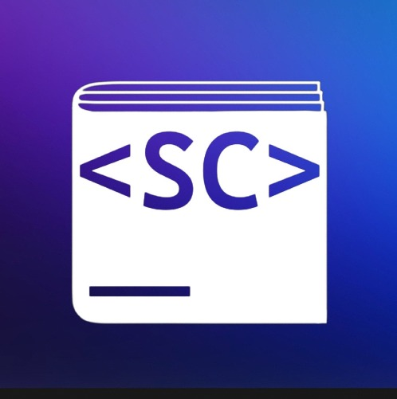
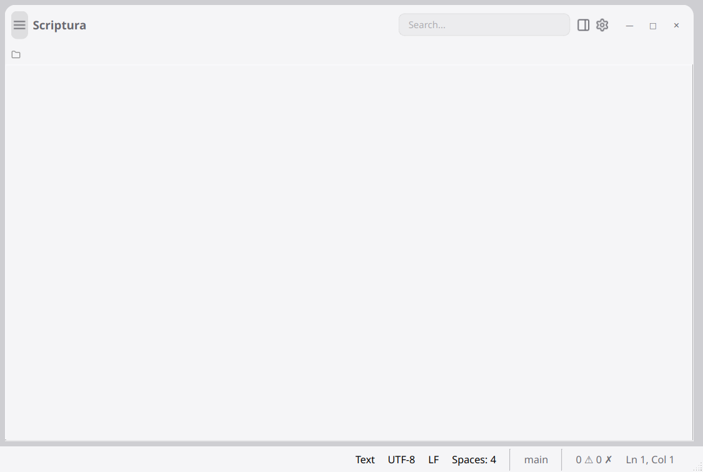

<div align="center">

# Scriptura



> scriptura- a proposed AI powered IDE that actively developing toward v1

A hybrid Qt/Rust text editor with project file browsing — **Qt for the UI, Rust for safe backend services**.

> **Note:** This project is at an early development stage which expects bugs and occasional broken features.

---

## Preview



[](https://github.com/jason1015-coder/scriptura/actions/workflows/build.yml)
[](https://github.com/jason1015-coder/scriptura/actions/workflows/test.yml)

---

## Architecture

Scriptura uses a **dual-language architecture**:

| Layer | Language | Technology | Responsibility |
|-------|----------|-----------|----------------|
| **UI Layer** | C++ | Qt 6 Widgets | All visual components (editor, panels, menus, dialogs) |
| **Adapter Layer** | C++ | Qt + C FFI | Thin wrappers bridging Qt signals/slots to Rust callbacks |
| **Backend Layer** | Rust | Pure Rust (no Qt) | LSP/DAP protocol, event bus, plugin manager, task runner, updater, workspace, config, permissions |

The backend services are compiled into a static library (`libscriptura_backend.a`) via **Cargo** and linked into the C++ executable. Cross-language communication uses **C FFI** (`extern "C"`) with JSON strings for complex data. All state management and protocol handling runs in safe Rust.

</div>

<div align="center">

## Features

- **Project-based workflow**: Open a project directory to browse files
- **File tree sidebar**: Navigate project structure with clickable folders
- **In-place browsing**: Expand and collapse folders in the sidebar to move around the project
- **Tabbed editing**: Multiple files open in tabs

</div>

<div align="center">

## Requirements

- **Qt 6** (with Widgets, Network, Sql, and LinguistTools modules)
- **CMake 3.16+**
- **C++17 compiler** (GCC, Clang, MSVC)
- **Rust toolchain** (for building the backend) — Install via [rustup](https://rustup.rs/):

</div>

```bash
curl --proto =https --tlsv1.2 -sSf https://sh.rustup.rs | sh
```

<div align="center">

## Building

### Quick Build & Run (Debug)

</div>

```bash
./run.sh
```

> `./run.sh` builds the Rust backend and the Qt UI incrementally, then launches the app.

<div align="center">

### Build (Release)

</div>

```bash
cmake -B cmake-build-Release -S . -DCMAKE_BUILD_TYPE=Release
cmake --build cmake-build-Release -j$(nproc)
```

<div align="center">

### Manual Build

</div>

```bash
# Build Rust backend first
cd src/rust_backend && cargo build --release && cd ../..

# Build C++ project
cmake -B build -S . -DCMAKE_BUILD_TYPE=Release
cmake --build build --config Release -j$(nproc)
```

<div align="center">

## Running

</div>

```bash
./run.sh
```

<div align="center">

Or directly:

</div>

```bash
./cmake-build-Debug/scriptura
```

<div align="center">

## Downloads

Prebuilt binaries are produced by CI (`.github/workflows/build.yml` / `deploy.yml`).

### macOS — App is NOT notarized/signed ⚠️

The macOS build (`scriptura.app`) is **unsigned and not notarized** (no Apple Developer account is configured in CI). macOS Gatekeeper will therefore block the first launch with *"“Scriptura” can’t be opened because it is from an unidentified developer"* or *"damaged and can’t be opened"*.

To bypass the check on macOS:

**Option 1 — Right-click Open (easiest)**
1. In **Finder**, locate `scriptura.app` (do NOT use Launchpad).
2. **Control-click** (or right-click) the app and choose **Open**.
3. In the dialog, click **Open** again. The app is now whitelisted for future launches.

**Option 2 — Terminal (removes the quarantine flag)**

</div>

```bash
xattr -cr /path/to/scriptura.app
```

<div align="center">

Run this once after downloading/extracting the app, then open it normally.

**Option 3 — Allow apps from anywhere (macOS Sequoia+ may need this)**

</div>

```bash
sudo spctl --master-disable   # allows apps from "Anywhere" in System Settings > Privacy & Security
# ... open the app, then optionally re-enable:
sudo spctl --master-enable
```

<div align="center">

> If macOS still reports the app as *damaged*, Option 2 (`xattr -cr`) is the reliable fix — it clears the `com.apple.quarantine` attribute added when the archive was downloaded.

</div>

## Project Structure

```
scriptura/
├── src/
│   ├── rust_backend/         # Rust backend library (Cargo project)
│   │   ├── Cargo.toml
│   │   └── src/
│   │       ├── lib.rs         # Module tree & helpers
│   │       ├── ffi.rs         # All C FFI exports (~180 functions)
│   │       ├── eventbus.rs    # Pub/sub event system
│   │       ├── lsp/           # LSP protocol client
│   │       ├── dap/           # DAP protocol client
│   │       ├── plugin/        # Plugin manager & crash handler
│   │       ├── service_locator.rs, task_runner.rs, updater.rs, ...
│   │       └── workspace.rs, permission.rs, language_registry.rs, ...
│   ├── rust_adapter.cpp/h     # C++ wrappers bridging Qt ↔ Rust FFI
│   ├── *.cpp, *.h, *.ui       # Qt UI layer (code editor, panels, etc.)
│   ├── main.cpp               # Application entry point
│   └── ...
├── include/
│   └── scriptura/
│       ├── rust_backend.h     # C FFI header for all backend services
│       └── plugininterface.h  # Plugin SDK interface
├── docs/                      # Documentation
├── .github/workflows/         # CI/CD workflows
└── CMakeLists.txt             # CMake build system
```
