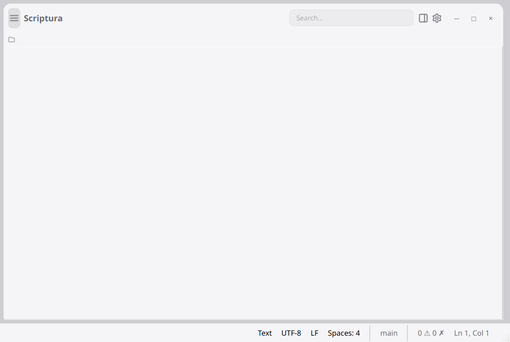

# Scriptura

Built by the [Nano Collective](https://nanocollective.org) — a community collective building AI tooling not for profit, but for the community.

A hybrid Qt and Rust code editor — Qt for the UI, Rust for safe backend services — shipping LSP, DAP, git, and a plugin SDK today, with a local-first AI assistant built on [Nanocoder](https://github.com/Nano-Collective/nanocoder) still to come.

[](https://github.com/jason1015-coder/scriptura/actions/workflows/build.yml)
[](https://github.com/jason1015-coder/scriptura/actions/workflows/test.yml)



> **Status:** pre-1.0, and in active development. Expect bugs and occasional broken features.

---

## Architecture

Scriptura uses a **dual-language architecture**:

| Layer | Language | Technology | Responsibility |
|-------|----------|-----------|----------------|
| **UI Layer** | C++ | Qt 6 Widgets | All visual components (editor, panels, menus, dialogs) |
| **Adapter Layer** | C++ | Qt + C FFI | Thin wrappers bridging Qt signals/slots to Rust callbacks |
| **Backend Layer** | Rust | Pure Rust (no Qt) | LSP/DAP protocol, event bus, plugin manager, task runner, updater, workspace, config, permissions |

The backend services are compiled into a static library (`libscriptura_backend.a`) via **Cargo** and linked into the C++ executable. Cross-language communication uses **C FFI** (`extern "C"`) with JSON strings for complex data. All state management and protocol handling runs in safe Rust.

---

## Features

### Working

**Editor core (`src/codeeditor.*`, `src/mainwindow_tabs.cpp`)**
- Project workflow: open project / file-tree (`QFileSystemModel`) / expand-collapse / tabbed editing / save / save-as / recent projects-files / auto-save
- Syntax highlighting (`CodeHighlighter` + `languageregistry.*`), line numbers, current-line, indent guides, `LargeFileHandler`, `EncodingManager` (detect / BOM / LF-CRLF), smart-indent + bracket auto-close
- Per-tab `Minimap` + `Breadcrumb` + `BreadcrumbBarWidget` + `CssBreadcrumbParser` (html / css / scss / xml / svg)
- `FoldManager`, `BracketColorizer`, `MultiCursorManager` (`Ctrl+D`, above / below), `ColumnSelection`, `SnippetManager` + editor dialog, `BookmarkManager` + `BookmarkPanelWidget`, inlay-hints, ghost-text infra, `CodeLensManager`, `RefactoringManager`, `CodeActionController`

**Search / navigate**
- `FindReplaceBar`, `ProjectSearchPanel` (bottom panel), `UniversalSearchPopup`, command palette, `ShortcutEditor`

**LSP (`src/mainwindow_lsp.cpp`, `rust_backend/src/lsp/`)**
- `start / stop / initialize / didOpen / didChange / didClose`, `completion / definition / declaration / implementation / typeDefinition / hover / references / rename / codeAction / documentSymbol / workspaceSymbol / formatting / signatureHelp`, diagnostics render + jump-to-error

**DAP / Run (`src/mainwindow_debug.cpp`, `services/dap/`, `rust_backend/src/dap/`)**
- `RunDialog`, `.vscode/launch.json` load / save, `startDebug / stopDebug`, breakpoint gutter, `continue / next / stepIn / stepOut / pause`, stack / scopes / variables / evaluate, run-without-debug via `QProcess`

**Tasks / Git (basic)**
- Rust `task_runner.rs` + `TaskRunnerUI` bottom panel + `Ctrl+Shift+B`, detects `package.json` / `Makefile` / `Cargo` tasks
- Git commit / push / pull / fetch via `QProcess`, `GitPlugin` (`com.scriptura.git`), `GitRebaseWidget` bottom panel, `GitBlame` gutter + Rust `blame_engine` / `diff_engine`, status-bar branch

**Rust backend (`src/rust_backend/src/ffi.rs`, 162 `pub extern "C"`)**
- `eventbus`, `service_locator`, `workspace` (folders / settings / recent), `updater` + `version_fetcher` (Stable / Pre-release check), `config_validator`, `archive_extractor`, `permission`, `plugin/manager` + `crash_handler` + `dependency_resolver`, `registry`, `language_registry` + `language_server_manager`, `session_engine` (restore + hot-exit), `filewatcher`, `diff / encoding / blame / emmet / test / ui_actions`, `framer`

**Plugins / themes / shell**
- `ScripturaPlugin` SDK (`sdk/`, `include/scriptura/plugininterface.h`), `PluginManagerDialog`, `PluginContext` + Editor / Ui / Notification / Theme APIs, `ApplicationManager` + `FirstRunInstallDialog`
- `PluginMarketplaceWidget` bottom panel, registry-URL setting, `ThemeManager` (8 families × Light / Dark) + `ThemeIcons`, `CustomTitleBar`, `WindowAnimator`, `WelcomeMenuScreen`, `StatusBarWidget`, `NotificationCenter`, `ZenMode`, `SplitManager`
- Tests: `cargo test` + 32 `tests/test_*.cpp` (`ctest`), CI `build.yml` / `test.yml` on Linux / macOS / Windows

### Partially implemented (code + tests exist, not wired)

- `plugins/aiinlinecompletion.*`: OpenAI-compatible + Ollama `chat` / `generate` + debounce + `CodeEditor::setGhostText`, has `tests/test_aiinlinecompletion.*` — `setSettings / setEditor` commented out in `mainwindow.cpp:909-927`
- `panels/testpanel.*` + `widgets/testrunner.*` + Rust `test_engine.rs`: pytest / jest / cargo / go / ctest detect + parse — `TestPanel` never passed to `MainWindow::registerPanel()`
- `panels/markdownpreview.*`, `dataformatter.*`, `regextester.*`, `globalreplacepreview.*`, `gitbranchwidget.*`, `gitdiffwidget.*`, `gitmergewidget.*`: complete classes, never `new`'d in `MainWindow` — dormant
- `plugins/httpclientpanel.*`, `plugins/sqliteviewer.*`: complete + tested, only reachable as installable `ApplicationManager` Apps, not built-in panels
- `rust_backend/src/plugin_updater.rs:30`: `check()` is `TODO: Query the plugin registry` no-op (callbacks wired, never fire)
- `rust_backend/src/emmet_engine.rs` + `rust_emmet_expand`: FFI exists, no editor shortcut wired
- `config_validator.rs`: only JSON well-formedness, no schema enforcement
- `src/mainwindow_ui.cpp`: `Placeholder - setup methods will be extracted`

### Planned (explicit placeholders / TODOs)

- Inspector drawer (`mainwindow.cpp:508-524`): sparkle placeholder + `AI Assistant is in development` + `Coming soon — intelligent code assistance, refactoring suggestions`
- `TODO: nanocoder assistant in here`, `TODO: replace with nanocoder- inline completion`, `TODO: nanocoder settings UI (AI & Completions section goes here)` (`mainwindow.cpp:514,909`, `mainwindow_theme.cpp:294`)

### Roadmap

1. `nanocoder` AI assistant (inspector) + inline completion + `AI & Completions` settings
2. Wire up dormant panels: Test panel, Markdown preview, DataFormatter, RegexTester, Git Branch / Diff / Merge, GlobalReplacePreview
3. Graduate `HTTP / SQLite` Apps vs built-ins decision
4. Real plugin / theme registry (current default `https://example.com/plugin-registry.json`), implement `PluginUpdater::check()`
5. Schema-aware `ConfigValidator`, Emmet keybinding, `TestPanel::jumpToTest` file / line extraction (`testpanel.cpp:208 TODO`)
6. Prod hardening toward `v1`: macOS sign / notarize, `pluginhost` sandbox stays removed (`CMakeLists.txt:260`)

---

## Requirements

- **Qt 6** (with Widgets, Network, Sql, and LinguistTools modules)
- **CMake 3.16+**
- **C++17 compiler** (GCC, Clang, MSVC)
- **Rust toolchain** (for building the backend) — install via [rustup](https://rustup.rs):

```bash
curl --proto =https --tlsv1.2 -sSf https://sh.rustup.rs | sh
```

---

## Building

### Quick build and run (Debug)

```bash
./run.sh
```

> `./run.sh` builds the Rust backend and the Qt UI incrementally, then launches the app.

### Build (Release)

```bash
cmake -B cmake-build-Release -S . -DCMAKE_BUILD_TYPE=Release
cmake --build cmake-build-Release -j$(nproc)
```

### Manual build

```bash
# Build Rust backend first
cd src/rust_backend && cargo build --release && cd ../..

# Build C++ project
cmake -B build -S . -DCMAKE_BUILD_TYPE=Release
cmake --build build --config Release -j$(nproc)
```

### Running

```bash
./run.sh
```

Or directly:

```bash
./cmake-build-Debug/scriptura
```

---

## Downloads

Prebuilt binaries are produced by CI (`.github/workflows/build.yml` / `deploy.yml`).

### macOS — the app is NOT notarized or signed

The macOS build (`scriptura.app`) is **unsigned and not notarized** (no Apple Developer account is configured in CI). macOS Gatekeeper will therefore block the first launch with *"“Scriptura” can’t be opened because it is from an unidentified developer"* or *"damaged and can’t be opened"*.

**Option 1 — Right-click Open (easiest)**

1. In **Finder**, locate `scriptura.app` (do NOT use Launchpad).
2. **Control-click** (or right-click) the app and choose **Open**.
3. In the dialog, click **Open** again. The app is now whitelisted for future launches.

**Option 2 — Terminal (removes the quarantine flag)**

```bash
xattr -cr /path/to/scriptura.app
```

Run this once after downloading/extracting the app, then open it normally.

**Option 3 — Allow apps from anywhere (macOS Sequoia+ may need this)**

```bash
sudo spctl --master-disable   # allows apps from "Anywhere" in System Settings > Privacy & Security
# ... open the app, then optionally re-enable:
sudo spctl --master-enable
```

> If macOS still reports the app as *damaged*, Option 2 (`xattr -cr`) is the reliable fix — it clears the `com.apple.quarantine` attribute added when the archive was downloaded.

---

## Project structure

```
scriptura/
├── src/
│   ├── rust_backend/         # Rust backend library (Cargo project)
│   │   ├── Cargo.toml
│   │   └── src/
│   │       ├── lib.rs         # Module tree & helpers
│   │       ├── ffi.rs         # All C FFI exports (162 functions)
│   │       ├── eventbus.rs    # Pub/sub event system
│   │       ├── lsp/           # LSP protocol client
│   │       ├── dap/           # DAP protocol client
│   │       ├── plugin/        # Plugin manager & crash handler
│   │       ├── service_locator.rs, task_runner.rs, updater.rs, ...
│   │       └── workspace.rs, permission.rs, language_registry.rs, ...
│   ├── rust_adapter.cpp/h     # C++ wrappers bridging Qt ↔ Rust FFI
│   ├── *.cpp, *.h, *.ui       # Qt UI layer (code editor, panels, etc.)
│   ├── main.cpp               # Application entry point
│   └── ...
├── include/
│   └── scriptura/
│       ├── rust_backend.h     # C FFI header for all backend services
│       └── plugininterface.h  # Plugin SDK interface
├── sdk/                      # Plugin SDK package
├── tests/                    # ctest suites for the Qt/C++ layer
├── translations/             # Qt Linguist sources
├── .github/workflows/        # CI/CD workflows
└── CMakeLists.txt            # CMake build system
```

---

## Community

Scriptura is built by the [Nano Collective](https://nanocollective.org), a community collective building AI tooling not for profit, but for the community. The work needs a second maintainer as much as it needs code.

- **Contribute**: see [CONTRIBUTING.md](CONTRIBUTING.md) for development setup, coding standards, and the test gate
- **The collective**: [nanocollective.org](https://nanocollective.org) · [docs](https://docs.nanocollective.org) · [GitHub](https://github.com/Nano-Collective) · [Discord](https://discord.gg/ktPDV6rekE)
- **Support the work**: the [Support page](https://docs.nanocollective.org/collective/organisation/support) covers donations and sponsorship
- **Paid contribution**: the [Economics Charter](https://docs.nanocollective.org/collective/organisation/economics-charter) sets out how scoped paid bounties work
